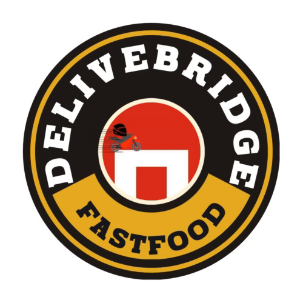
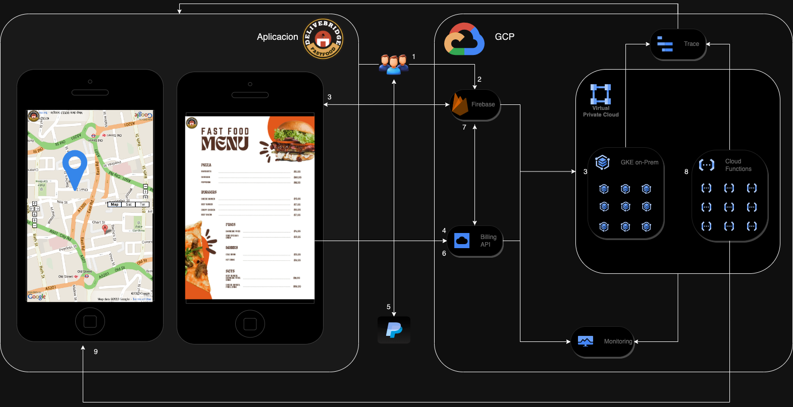

# ¡DeliveBridge🛵! - Guía de Implementación en Google Cloud Platform (GCP)

  
  <h1>Infraestructura en Google Cloud Platform para DeliveBridge</h1>

¡Bienvenido al futuro de la entrega de comida a domicilio con Google Cloud Platform! ¡DeliveBridge! es una aplicación que revoluciona la experiencia de pedidos de comida a través de una infraestructura potente y escalable. Aquí tienes una guía detallada para implementar ¡DeliveBridge 🛵! en GCP.

## Pasos para Implementar ¡DeliveBridge!

### 1. Firebase para el Desarrollo de la Aplicación
Firebase proporciona una plataforma integral para el desarrollo de aplicaciones. Utilízalo para gestionar la autenticación de usuarios y mostrar los menús de los restaurantes de manera eficiente.

### 2. Google Kubernetes Engine (GKE) o Cloud Run para la Gestión de Pedidos
GKE ofrece una solución robusta para gestionar la lógica de los pedidos y comunicarse eficazmente con los restaurantes.

### 3. Cloud Functions para la Entrega de Pedidos
Implementa Cloud Functions para manejar la lógica de la entrega de pedidos, como la asignación de repartidores y la actualización del estado de los pedidos.

### 4. Cloud Trace para el Seguimiento de Pedidos
Cloud Trace te permite inspeccionar la latencia de las solicitudes, garantizando que los pedidos se entreguen lo más rápido posible.

### 5. APIs de Google Maps para el Seguimiento de la Ubicación de los Pedidos
Utiliza las APIs de Google Maps para mostrar a los clientes la ubicación en tiempo real de sus pedidos.

* API de Maps JavaScript o SDK de Maps para Android/iOS
* API de Geolocation
* API de Directions

### 6. Google Cloud Billing para el Manejo de Pagos
Google Cloud Billing te permite gestionar formas de pago, garantizando una facturación eficiente.

* #### Pago externo
    * Paypal 

### 7. Cloud Monitoring para el Monitoreo de la Aplicación
Cloud Monitoring proporciona visibilidad sobre el rendimiento y el estado general de la aplicación, asegurando un funcionamiento óptimo.

## ¡Actúa Ahora! 🚀

Implementar ¡DeliveBridge🛵! en GCP te coloca en el camino hacia el éxito en la industria de pedidos de comida a domicilio. ¡No pierdas la oportunidad de ofrecer una experiencia inigualable a tus clientes!

### [Crea tu Proyecto en GCP](https://console.cloud.google.com/?hl=es)

---

#### Citas:

* [Historia de Éxito - PedidosYa](https://cloud.google.com/customers/pedidosya?hl=es-419)

